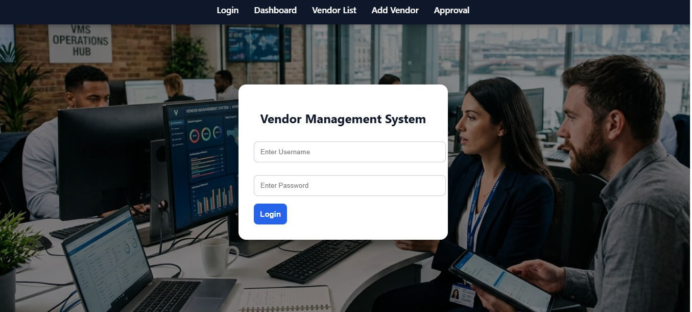
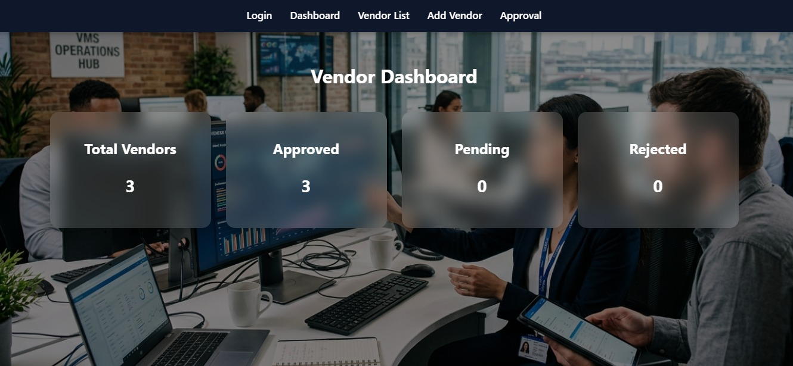
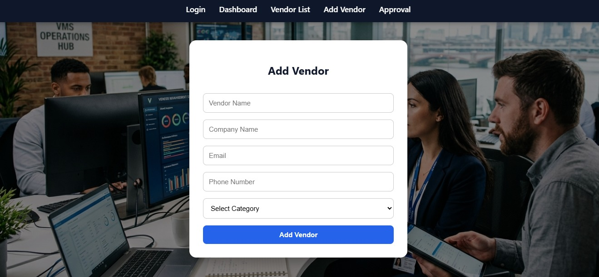
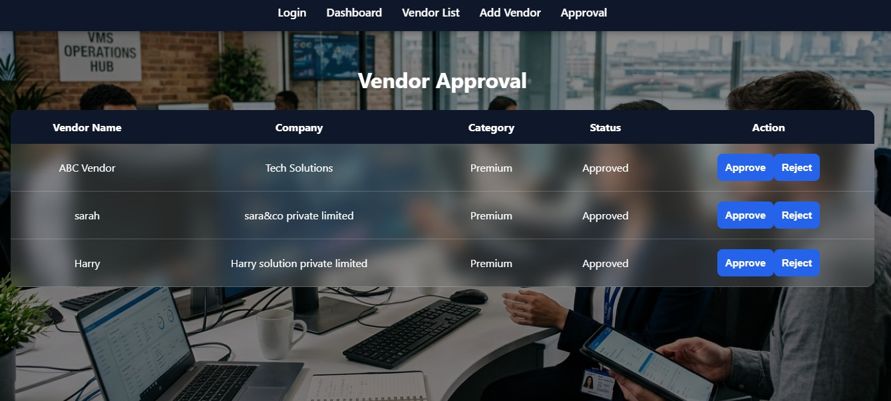
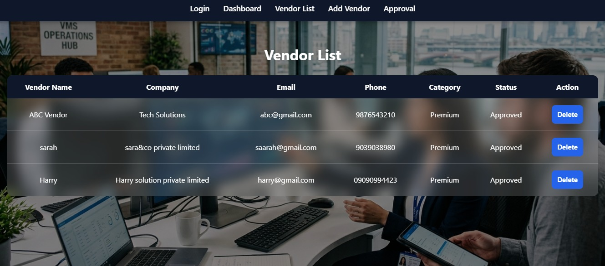

# Vendor Management System

A full-stack application built using React, Spring Boot, and MySQL for managing vendors and their approval workflow.

## Features

* Add Vendor
* View Vendors
* Approve Vendor
* Reject Vendor
* Delete Vendor
* Dashboard Analytics

## Tech Stack

* React.js
* Spring Boot
* MySQL
* Axios
* REST API

---

## Login Page



---

## Dashboard



---

## Add Vendor



---

## Vendor Approval



---

## Vendor List



---

## Project Structure

vendor-management-system/

├── public/

├── src/

│ ├── assets/

│ ├── components/

│ ├── pages/

│ ├── services/

│ └── screenshots/

├── package.json

└── README.md

---

## How to Run

### Frontend

```bash
npm install
npm start
```

### Backend

```bash
mvn spring-boot:run
```

### Database

* Create a MySQL database.
* Update database credentials in `application.properties`.
* Run the Spring Boot application.

---

## Author

**Abinaya Selvaganesan**
 Java Full Stack Developer
